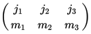
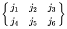
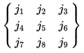

# Wigner3j6j9j

Calculators for the Wigner 3j, 6j, and 9j symbols,
relevant to angular momentum coupling in quantum physics.

* [3j symbol](https://en.wikipedia.org/wiki/3-j_symbol)  - for two angular momenta

* [6j symbol](https://en.wikipedia.org/wiki/6-j_symbol)  - for three angular momenta

* [9j symbol](https://en.wikipedia.org/wiki/9-j_symbol)  - for four angular momenta

#### Instructions

To build the Java .jar archive, run Ant (on build.xml, by default).
```
ant
```

To launch a calculator, run its shell script.
```
wigner3j.sh
wigner6j.sh
wigner9j.sh
```

#### License

   Copyright &copy; 2004-2017 svengato

   Licensed under the Apache License, Version 2.0 (the "License");
   you may not use this file except in compliance with the License.
   You may obtain a copy of the License at

       http://www.apache.org/licenses/LICENSE-2.0

   Unless required by applicable law or agreed to in writing, software
   distributed under the License is distributed on an "AS IS" BASIS,
   WITHOUT WARRANTIES OR CONDITIONS OF ANY KIND, either express or implied.
   See the License for the specific language governing permissions and
   limitations under the License.
